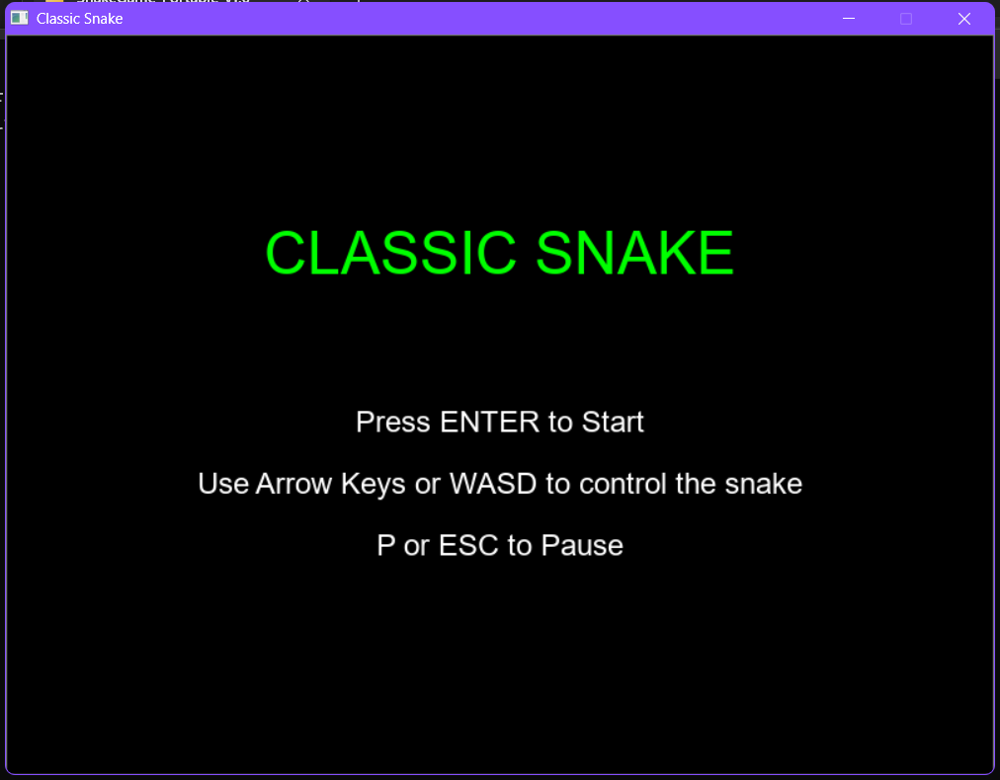
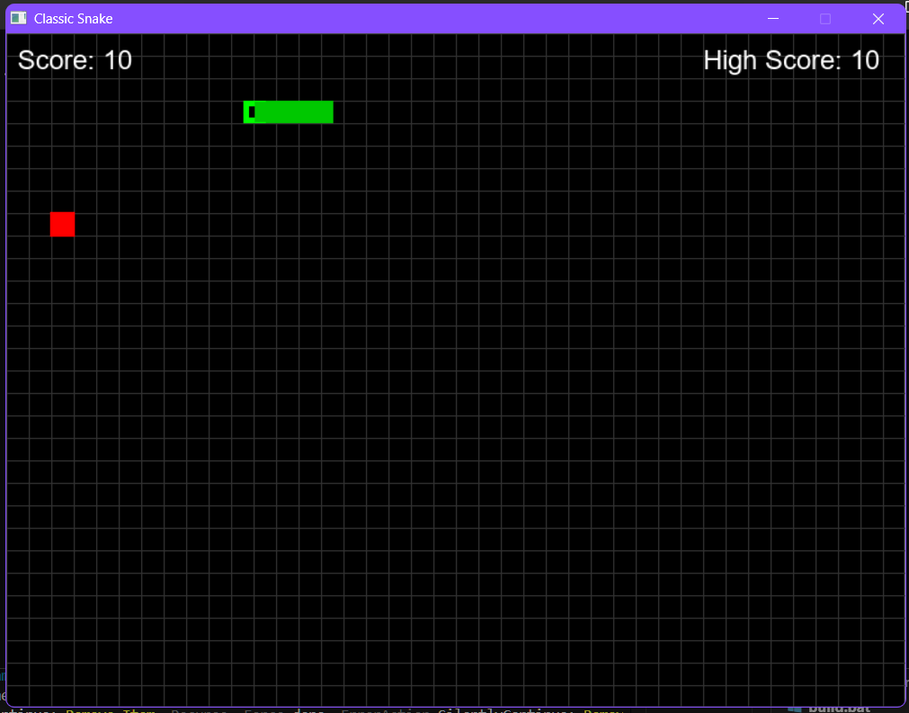

# 🐍 Classic Snake Game
### *A Modern C++ Implementation with SDL2*

<div align="center">


*🎮 Relive the nostalgia of the classic Snake game with modern C++ and smooth SDL2 graphics! 🎮*

</div>

---

## 🌟 Project Overview

Welcome to the **Classic Snake Game** - a carefully crafted recreation of the timeless arcade classic that has captivated players for decades! This project demonstrates modern C++ programming techniques combined with the powerful SDL2 multimedia library to deliver a smooth, engaging gaming experience on Windows.

## 📸 Game Screenshots

<div align="center">

### 🏠 Main Menu

*Clean and intuitive main menu with retro arcade aesthetics*

### 🎮 Gameplay in Action

*Smooth 60fps gameplay with responsive controls and beautiful graphics*

### 💀 Game Over Screen

*Professional game over screen with score display and restart options*

</div>

### 🎯 What Makes This Special?

- **🚀 Performance Optimized**: Built with C++17 standards for maximum efficiency
- **🎨 Smooth Graphics**: Leveraging SDL2 for buttery-smooth 60fps gameplay
- **🔊 Immersive Audio**: Dynamic sound effects using SDL2_mixer
- **📝 Beautiful Typography**: Custom arcade fonts with SDL2_ttf
- **🛠️ Easy Setup**: Automated build scripts for hassle-free compilation
- **📦 Portable**: Self-contained executable with all dependencies included

---

## ✨ Features Showcase

### 🎮 **Core Gameplay**
- **Classic Snake Mechanics**: Authentic movement and collision detection
- **Progressive Difficulty**: Snake speed increases as you grow longer
- **Smart Food Spawning**: Strategic food placement for optimal challenge
- **Precise Collision**: Pixel-perfect collision detection for fair gameplay

### 🎨 **Visual Excellence**
- **Retro Arcade Aesthetics**: Nostalgic pixel-perfect graphics
- **Smooth Animations**: Fluid snake movement with direction-aware head graphics
- **Dynamic UI**: Real-time score updates and game state indicators
- **Grid-Based Design**: Clean, organized game field layout

### 🔊 **Audio Experience**
- **Sound Effects**: Satisfying audio feedback for eating, moving, and game over
- **Audio Management**: Optimized sound loading and playback system

### 📊 **Game Features**
- **Score Tracking**: Real-time score calculation and display
- **High Score System**: Persistent high score saving across sessions
- **Game States**: Professional state management (Menu, Playing, Paused, Game Over)
- **Responsive Controls**: Instant input response with prevention of invalid moves

---

## 🎮 How to Play

### 🕹️ Controls

| Key | Action | Description |
|-----|--------|-------------|
| ⬆️⬇️⬅️➡️ | **Arrow Keys** | Move snake in desired direction |
| 🇼🇦🇸🇩 | **WASD** | Alternative movement controls |
| ⏯️ | **Enter** | Start game / Restart after Game Over |
| ⏸️ | **P or Escape** | Pause/Resume game |
| ❌ | **Close Window** | Exit game |

### 🎯 Objective
1. **Control the Snake**: Navigate your snake around the game field
2. **Eat Food**: Collect red food items to grow longer and increase your score
3. **Avoid Collisions**: Don't hit the walls or your own body
4. **Achieve High Scores**: Challenge yourself to beat your personal best!

### 🏆 Scoring System
- **+10 Points** for each food item consumed
- **Bonus Points** for longer survival streaks
- **High Score** automatically saved and displayed

---

## 🚀 **Quick Play (No Installation Required!)**

### 🎮 **Instant Download & Play**

Want to play immediately without any setup? Download the portable version:

**[📥 Download SnakeGame_Portable_v1.0.zip](https://github.com/sharmaram25/Snake-Game-C-language-/raw/master/SnakeGame_Portable_v1.0.zip)**

🎯 **Just 3 simple steps:**
1. **Download** the ZIP file above
2. **Extract** it anywhere on your computer  
3. **Double-click** `SnakeGame.exe` to start playing!

✨ **Features of Portable Version:**
- 📦 **Zero Installation** - No setup required
- 🚀 **Instant Play** - Just extract and run
- 💾 **Self-Contained** - All libraries included
- 🔒 **Safe** - No system modifications needed
- 📱 **Portable** - Run from USB drive or any folder

---

## 🛠️ Installation & Setup

### 🚀 **Quick Start (For Developers)**

If you want to build from source, here's the easiest way:

```batch
# 1. Complete Automatic Setup (Downloads everything and builds)
setup_complete.bat

# 2. Start Playing!
run.bat
```

**That's it!** The setup script will automatically:
- 📥 Download SDL2, SDL2_ttf, and SDL2_mixer libraries
- ⚙️ Configure the development environment  
- 🔨 Compile the game with optimizations
- 📦 Prepare all files for execution

### 🔧 **Step-by-Step Manual Setup**

If you prefer more control over the process:

```batch
# Step 1: Download all SDL2 libraries
download_sdl.bat

# Step 2: Configure environment variables
setup_environment.bat

# Step 3: Build the project
build.bat

# Step 4: Run the game
run.bat
```

### 🏗️ **Advanced Manual Build**

For developers who want full control:

#### Prerequisites
- **CMake** 3.10+ (included in `deps/` folder)
- **C++ Compiler** (Visual Studio 2019+, MinGW-w64, or Clang)
- **SDL2 Development Libraries** (auto-downloaded by scripts)

#### Build Process
```bash
# Create build directory
mkdir build && cd build

# Configure with CMake
cmake .. -DCMAKE_BUILD_TYPE=Release

# Build the project
cmake --build . --config Release

# Run the executable
./Release/SnakeGame.exe
```

---

## 📁 Project Structure

```
Snake-Game-C-language/
├── 📂 src/                    # Source code files
│   ├── 🎮 main.cpp           # Entry point & game loop
│   ├── 🎯 game.cpp           # Core game logic
│   ├── 🐍 snake.cpp          # Snake entity management
│   ├── 🍎 food.cpp           # Food spawning & collision
│   ├── 🔊 sound.cpp          # Audio system
│   ├── 📝 text.cpp           # Text rendering
│   └── 🔲 grid.cpp           # Game grid management
├── 📂 include/                # Header files
│   ├── 🎮 game.h
│   ├── 🐍 snake.h
│   ├── 🍎 food.h
│   ├── 🔊 sound.h
│   ├── 📝 text.h
│   └── 🔲 grid.h
├── 📂 assets/                 # Game assets
│   ├── 📂 fonts/             # Typography files
│   │   └── 🎨 ARCADE_I.TTF   # Retro arcade font
│   └── 📂 sounds/            # Audio files
│       ├── 🔊 eat.wav        # Food consumption sound
│       ├── 💀 game_over.wav  # Game over sound
│       └── 🎵 move.wav       # Movement sound
├── 📂 scripts/               # Build automation
│   ├── 🚀 setup_complete.bat # One-click setup
│   ├── 📥 download_sdl.bat   # Library downloader
│   ├── 🔨 build.bat          # Build script
│   └── ▶️ run.bat            # Game launcher
├── 🔧 CMakeLists.txt         # Build configuration
└── 📖 README.md              # You are here!
```

---

## 🎨 Technical Highlights

### 🏗️ **Architecture Design**
- **Object-Oriented Design**: Clean separation of concerns with dedicated classes
- **State Management**: Professional game state handling (Menu → Playing → GameOver)
- **Resource Management**: Efficient memory handling with RAII principles
- **Event-Driven**: Responsive input handling with SDL2 event system

### 🔧 **Key Technologies**
- **C++17**: Modern language features for clean, efficient code
- **SDL2**: Cross-platform multimedia library for graphics and input
- **SDL2_ttf**: TrueType font rendering for beautiful text
- **SDL2_mixer**: High-quality audio mixing and playback
- **CMake**: Cross-platform build system for easy compilation

### ⚡ **Performance Features**
- **60 FPS Gameplay**: Smooth frame rate with optimized rendering
- **Efficient Collision Detection**: Fast algorithms for real-time collision checking
- **Memory Optimization**: Minimal memory footprint with smart resource management
- **Responsive Input**: Sub-frame input latency for precise control

---

## 🎯 Game Mechanics Deep Dive

### 🐍 **Snake Behavior**
- **Continuous Movement**: Snake moves automatically in the current direction
- **Direction Queue**: Prevents rapid direction changes and invalid 180° turns
- **Growth System**: Snake body extends from the tail when food is consumed
- **Collision Detection**: Precise boundary and self-collision detection

### 🍎 **Food System**
- **Random Spawning**: Food appears in random valid positions
- **Collision Avoidance**: Food never spawns on the snake's body
- **Visual Feedback**: Clear visual distinction between food and snake
- **Score Integration**: Each food item contributes to the player's score

### 🎮 **Game States**
1. **Menu State**: Welcome screen with instructions
2. **Playing State**: Active gameplay with real-time updates
3. **Paused State**: Game suspension with resume capability
4. **Game Over State**: Score display with restart option

---

## 🚀 Future Enhancements

### 🎯 **Planned Features**
- [ ] **Multiple Difficulty Levels**: Easy, Medium, Hard, Extreme
- [ ] **Power-ups**: Special items with temporary effects
- [ ] **Multiplayer Mode**: Local two-player snake battles
- [ ] **Themes**: Multiple visual themes and color schemes
- [ ] **Leaderboard**: Online score sharing and competition
- [ ] **Mobile Port**: Android/iOS versions using SDL2
- [ ] **Level System**: Progressive unlocking of new challenges

### 🎨 **Visual Improvements**
- [ ] **Particle Effects**: Food consumption and collision effects
- [ ] **Smooth Animations**: Interpolated movement for ultra-smooth gameplay
- [ ] **Background Music**: Atmospheric soundtrack options
- [ ] **Custom Skins**: Unlockable snake appearances

---

## 🤝 Contributing

We welcome contributions from the community! Here's how you can help:

### 🐛 **Bug Reports**
Found a bug? Please open an issue with:
- Detailed description of the problem
- Steps to reproduce
- Your system specifications
- Screenshots/videos if applicable

### 💡 **Feature Requests**
Have an idea? We'd love to hear it! Please include:
- Clear description of the feature
- Use cases and benefits
- Mockups or examples if available

### 🔧 **Code Contributions**
Ready to code? Follow these steps:
1. **Fork** the repository
2. **Create** a feature branch (`git checkout -b feature/AmazingFeature`)
3. **Commit** your changes (`git commit -m 'Add some AmazingFeature'`)
4. **Push** to the branch (`git push origin feature/AmazingFeature`)
5. **Open** a Pull Request

---

## 📋 System Requirements

### 🖥️ **Minimum Requirements**
- **OS**: Windows 7 or later (64-bit recommended)
- **Processor**: Intel Core i3 or AMD equivalent
- **Memory**: 512 MB RAM
- **Graphics**: DirectX 9 compatible
- **Storage**: 50 MB available space
- **Sound**: DirectX compatible sound card

### ⚡ **Recommended Requirements**
- **OS**: Windows 10/11 (64-bit)
- **Processor**: Intel Core i5 or AMD Ryzen 5
- **Memory**: 2 GB RAM
- **Graphics**: Dedicated graphics card
- **Storage**: 100 MB available space (SSD recommended)
- **Sound**: High-quality audio system for best experience

---

## 📜 License

This project is open source and available under the **MIT License**. See the [LICENSE](LICENSE) file for more details.

```
Copyright (c) 2025 Ram Sharma

Permission is hereby granted, free of charge, to any person obtaining a copy
of this software and associated documentation files (the "Software"), to deal
in the Software without restriction, including without limitation the rights
to use, copy, modify, merge, publish, distribute, sublicense, and/or sell
copies of the Software, and to permit persons to whom the Software is
furnished to do so, subject to the following conditions:

The above copyright notice and this permission notice shall be included in all
copies or substantial portions of the Software.
```

---

## 🙏 Acknowledgments

### 📚 **Libraries & Frameworks**
- **[SDL2](https://www.libsdl.org/)** - Cross-platform multimedia library
- **[SDL2_ttf](https://github.com/libsdl-org/SDL_ttf)** - TrueType font rendering
- **[SDL2_mixer](https://github.com/libsdl-org/SDL_mixer)** - Audio mixing library
- **[CMake](https://cmake.org/)** - Cross-platform build system

### 🎮 **Inspiration**
- The original **Snake** game creators
- Classic arcade game developers
- Modern indie game development community

### 🎨 **Assets**
- **ARCADE_I.TTF** - Retro arcade font for authentic feel
- Sound effects created and optimized for game experience

---

## 📞 Support & Contact

### 🆘 **Need Help?**
- 📧 **Email**: [Create an issue](https://github.com/sharmaram25/Snake-Game-C-language-/issues)
- 💬 **Discussions**: Use GitHub Discussions for questions
- 🐛 **Bug Reports**: Open an issue with detailed information

### 🌟 **Show Your Support**
If you enjoyed this project:
- ⭐ **Star** this repository
- 🍴 **Fork** it for your own modifications
- 📤 **Share** with friends and fellow developers
- 💬 **Leave feedback** in the discussions

---

<div align="center">

### 🎮 **Ready to Play?**

**[Download Latest Release](https://github.com/sharmaram25/Snake-Game-C-language-/releases)** | **[View Source Code](https://github.com/sharmaram25/Snake-Game-C-language-)** | **[Report Issues](https://github.com/sharmaram25/Snake-Game-C-language-/issues)**

---

*Made with ❤️ and lots of ☕ by Ram Sharma*

**Happy Gaming! 🐍🎮**

</div>
